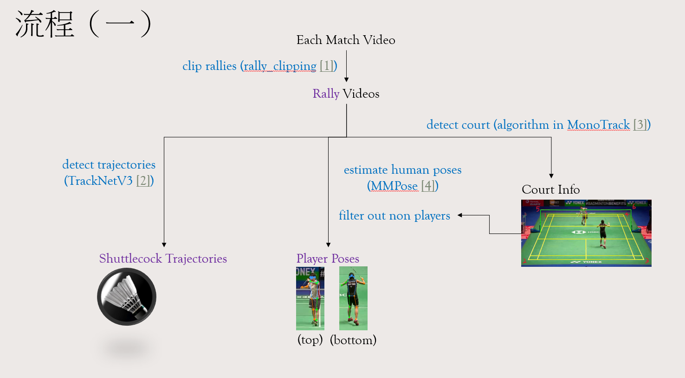

# Badminton shot type identification end-to-end system

## Progress
- [x] Rally clipping
    - A folder `videos` containing rally videos will be created in the root directory of the project.
- [x] Court detection
    - Results of `court.txt` and `court_image.png` will be stored in `court_detection/`.
- [x] TrackNet & Pose
    - The `clips/` folder.