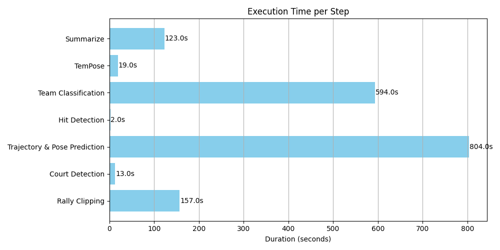

# Badminton AI End-to-End System

> My Python version: 3.11.9

## Installation

It's better to use virtual environment to install the required packages and run the program.
```bash
python -m venv venv
venv/Scripts/activate    # for Windows
pip install -r requirements.txt
```

### Torch with CUDA

To support torch with cuda, which is necessary:
```bash
pip install torch==2.1.0 torchvision==0.16.0 torchaudio==2.1.0 --index-url https://download.pytorch.org/whl/cu118
```

### MMCV

We recommend to use `openmim` (which is already included in `requirements.txt`) to install `mmcv`. Run the following command:
```bash
mim install mmcv==2.1.0
```

## Usage

Modify `sample.mp4` to your own video path in `main.py`:
```py
video_path = Path('sample.mp4')
```
Currently, the program can only process one video at one time. The result will be store in the `videos/` folder. Take `sample.mp4` as example, the organization of folder may look like:
```
/videos
│── /sample               
│   │── /clip_1
│   │   │── clip_1_ball.csv                  # trajectory
│   │   │── clip_1_bottom.csv                # pose of bottom player
│   │   │── clip_1_hits.csv                  # hit frame (binary)
│   │   │── clip_1_pred.mp4                  # visualization of pose
│   │   │── clip_1_teams.csv                 # team classification
│   │   │── clip_1_teams.mp4                 # team classification video
│   │   │── clip_1_top.csv                   # pose of top player
│   │   │── clip_1_visualized_output.csv     # visualization of trajectory
│   │   │── clip_1.mp4                       # original video
│   │   │── *.npy                            # other files for TemPose
|   |
|   │── /clip_3 ...

```

### Sample Match

The link below provides a sample match video. The duration of video is about 20 minutes, including cutscene.
- [TOYOTA Thailand Open | Day 4: An Se Young (KOR) [7] vs. Pornpawee Chochuwong (THA) - Set 1](https://drive.google.com/file/d/1d2Y1BEy4gYv25UcB1pRduWsKySfUzlz_/view?usp=drive_link)

> Full video: [Youtube - BWF](https://www.youtube.com/watch?v=TXT-qlniM90)

The time cost is about 30 minutes.


## HitNet

I've just found that the current HitNet model is not suitable enough for the frame-level classification task.
I'm currently working on improving the model and will release a new version these days.
The new trained model performance:
```
Best threshold = 0.56, Recall = 0.8817
          Val Loss: 0.2796 |   Val Recall: 0.8817 |   Val F1: 0.7530

              precision    recall  f1-score   support

           0       0.99      0.90      0.94     26066
           1       0.42      0.86      0.56      2194

    accuracy                           0.90     28260
   macro avg       0.70      0.88      0.75     28260
weighted avg       0.94      0.90      0.91     28260

[[0.8992941  0.1007059 ]
 [0.13582498 0.86417502]]
```

## License Notice

This project includes components adapted from the [monotrack](https://github.com/jhwang7628/monotrack) repository by Adobe, under the Adobe Research License.  
The usage is limited to non-commercial academic research, including undergraduate coursework.  
See `ai_badminton/LICENSE_ADOBE.txt` for details.
